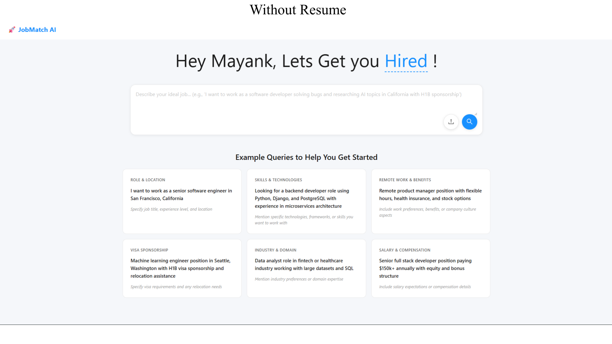
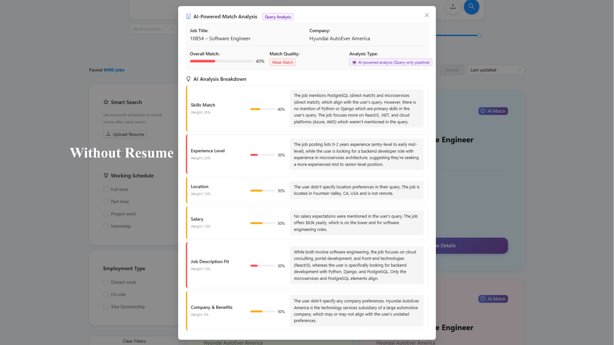
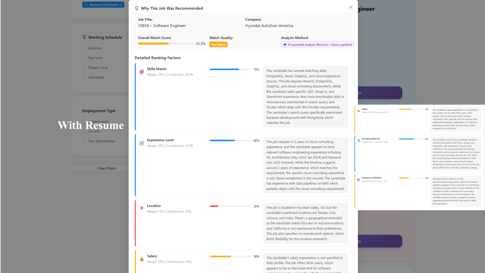
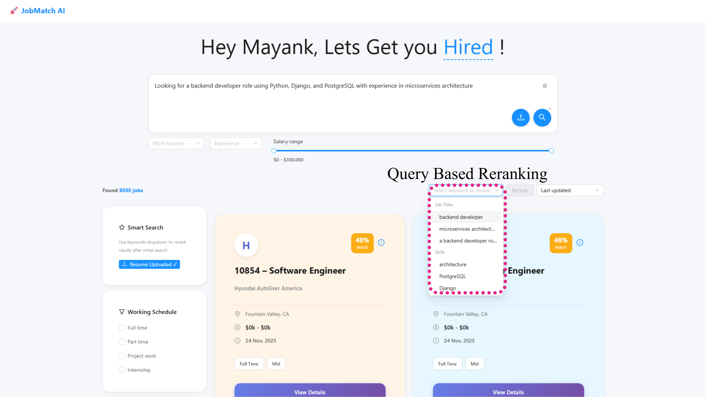

# JobMatch AI - Demo Package

A complete AI-powered job matching system featuring semantic search, knowledge graphs, and intelligent job recommendations.

## Features

- **Semantic Job Search**: Natural language queries with AI understanding
- **Resume Matching**: Upload resumes and get personalized job recommendations
- **Knowledge Graph**: Visualize skill relationships and job connections
- **AI-Powered Reranking**: Intelligent job scoring with detailed explanations
- **Multi-Database Architecture**: Elasticsearch for search, Neo4j for relationships

## Quick Start

### Prerequisites

Before you begin, ensure you have:

- **Docker Desktop** installed and running
  - [Download for macOS](https://docs.docker.com/desktop/install/mac-install/)
  - [Download for Windows](https://docs.docker.com/desktop/install/windows-install/)
  - [Download for Linux](https://docs.docker.com/desktop/install/linux-install/)
- **8GB+ RAM** available for Docker
- **10GB+ free disk space**
- **Internet connection** for pulling Docker images

### Installation

#### Linux / macOS

```bash
# 1. Make the installer executable
chmod +x install.sh

# 2. Run the installer
./install.sh
```

#### Windows

```powershell
# Run in PowerShell
.\install.ps1
```

### First-Time Setup

When you run the installer for the first time:

1. It will create a `.env` file from `.env.example`
2. **Optional**: Edit the `.env` file to add:
   - `ANTHROPIC_API_KEY`: For AI-powered reranking explanations (optional)

Example `.env`:
```env
ANTHROPIC_API_KEY=sk-ant-xxx  # Optional - for AI features
```

**Note**: Docker images are pre-configured:
- Backend: `mvyas7/job-hunt-ai-backend:latest`
- Frontend: `mvyas7/job-hunt-ai-frontend:latest`

No additional configuration needed!

### What the Installer Does

The installation script will:

1. Check that Docker is installed and running
2. Pull pre-built images from Docker Hub
3. Start all services (Elasticsearch, Neo4j, Backend, Frontend)
4. Initialize demo data
5. Display access URLs

**Installation takes 2-3 minutes** depending on your internet speed.

## Accessing the Application

After installation, access the application at:

| Service | URL | Description |
|---------|-----|-------------|
| **Frontend** | http://localhost:3001 | Main web interface |
| **Backend API** | http://localhost:8000 | REST API endpoints |
| **API Documentation** | http://localhost:8000/docs | Interactive API docs (Swagger) |
| **Elasticsearch** | http://localhost:9200 | Search engine |
| **Neo4j Browser** | http://localhost:7474 | Graph database UI |

### Neo4j Login Credentials

```
Username: neo4j
Password: password
```

## Live Demo Screenshots

### 1. Landing Page


The landing page welcomes users with a clean, modern interface showcasing the platform's capabilities. Users can choose to start searching immediately or upload their resume for personalized recommendations. The dashboard displays key metrics including 10,000+ jobs indexed, 5,000+ skills mapped, 500+ companies, and a 95% success rate.

### 2. Classic Search Interface


The search interface provides multiple dimensions for job discovery. Users can enter natural language queries with intelligent search suggestions based on different search criteria:
- **Role & Location**: Target specific positions and geographic preferences
- **Skills & Technologies**: Search by technical skills, frameworks, and tools
- **Remote Work & Benefits**: Filter by work arrangements and company perks
- **Visa Sponsorship**: Find opportunities with H1B support and relocation assistance
- **Industry & Domain**: Focus on specific sectors like fintech or healthcare
- **Salary & Compensation**: Set salary expectations and equity preferences

### 3. AI Match Analysis - Without Resume


When searching without a resume, the AI provides detailed explanations for why each job appears in the results. The system analyzes multiple factors:
- **Skills Match**: Direct and indirect skill alignments with the query
- **Experience Level**: How the job's requirements match the search criteria
- **Location**: Geographic fit based on preferences
- **Salary**: Compensation alignment with market expectations
- **Job Description Fit**: Semantic analysis of role requirements
- **Company & Benefits**: Company culture and benefits matching

Each factor is weighted and explained, helping users understand the relevance score.

### 4. AI Recommendations - With Resume


After uploading a resume, the platform provides personalized job recommendations with comprehensive match analysis:
- **Overall Match Score**: Calculated based on resume content and job requirements
- **Skills Match (70% weight)**: Detailed breakdown of matching technical and soft skills
- **Experience Level (60% weight)**: Alignment between candidate experience and job expectations
- **Location (20% weight)**: Geographic preferences and remote work options
- **Salary (50% weight)**: Compensation expectations vs. job offerings
- **Company & Benefits (40% weight)**: Cultural fit and benefits alignment

The AI explains not just what matches, but why, providing transparency into the recommendation engine.

### 5. Query-Based Reranking


The smart search feature allows users to refine results using keyword-based reranking. After an initial search, users can use the dropdown to select specific keywords from their query (like "backend developer", "microservices architect", "PostgreSQL", "Django", etc.) to dynamically reorder results. This gives users fine-grained control over prioritization while maintaining the AI-powered relevance scoring. The system shows 9490+ jobs with match percentages, and users can further filter by work location, experience level, employment type, and working schedule.

## Using the Application

### 1. Search for Jobs

**Try these example searches:**

- "software engineer python machine learning"
- "data scientist with NLP experience"
- "frontend developer react typescript"
- "devops kubernetes cloud"

The system understands natural language and semantic meaning, not just keywords.

### 2. Upload Resume

1. Click **"Upload Resume"** in the frontend
2. Select a PDF or DOCX file
3. Get personalized job recommendations
4. See detailed match explanations

### 3. Explore Knowledge Graph

1. Go to http://localhost:7474
2. Login with Neo4j credentials
3. Run queries to explore:
   ```cypher
   // View all jobs
   MATCH (j:Job) RETURN j LIMIT 25

   // View job-skill relationships
   MATCH (j:Job)-[:REQUIRES]->(s:Skill)
   RETURN j, s LIMIT 50

   // Find similar jobs
   MATCH (j1:Job)-[:SIMILAR_TO]->(j2:Job)
   RETURN j1, j2 LIMIT 25
   ```

### 4. API Documentation

Visit http://localhost:8000/docs to:

- Explore all API endpoints
- Try API calls interactively
- See request/response schemas
- Test with sample data

## Configuration

### Environment Variables

Edit `.env` to customize:

```env
# Optional: Enable AI features (Anthropic Claude API)
ANTHROPIC_API_KEY=sk-ant-xxx

# Database credentials (default for demo)
NEO4J_USER=neo4j
NEO4J_PASSWORD=password
```

**Note**: Docker images are pre-configured in `docker-compose.yml`:
- `mvyas7/job-hunt-ai-backend:latest`
- `mvyas7/job-hunt-ai-frontend:latest`

### Port Configuration

If you have port conflicts, edit `docker-compose.yml`:

```yaml
ports:
  - "3001:8080"  # Change 3001 to another port
  - "8000:8000"  # Change 8000 to another port
```

## Managing the Application

### View Logs

```bash
# All services
docker compose logs -f

# Specific service
docker compose logs -f backend
docker compose logs -f frontend
```

### Stop Services

```bash
docker compose down
```

### Restart Services

```bash
docker compose restart

# Or restart specific service
docker compose restart backend
```

### Remove Everything (including data)

```bash
# Linux/Mac
./uninstall.sh

# Windows
.\uninstall.ps1

# Or manually
docker compose down -v
```

### Update Images

```bash
# Pull latest images
docker compose pull

# Restart with new images
docker compose up -d
```

## Troubleshooting

### Services Won't Start

**Check Docker resources:**
1. Open Docker Desktop
2. Go to Settings → Resources
3. Increase Memory to at least 8GB
4. Apply & Restart

**Check logs:**
```bash
docker compose logs
```

### Port Already in Use

Edit `docker-compose.yml` and change the port numbers:

```yaml
# Change this:
ports:
  - "3001:8080"

# To this (example):
ports:
  - "3002:8080"
```

### Images Won't Pull

**Verify images exist:**
1. Check images on Docker Hub:
   - https://hub.docker.com/r/mvyas7/job-hunt-ai-backend
   - https://hub.docker.com/r/mvyas7/job-hunt-ai-frontend
2. Try manual pull:
   ```bash
   docker pull mvyas7/job-hunt-ai-backend:latest
   docker pull mvyas7/job-hunt-ai-frontend:latest
   ```

### Backend Health Check Failing

Wait longer - the backend needs time to:
1. Start the Python application
2. Connect to Elasticsearch
3. Connect to Neo4j
4. Download NLP models (first run)

This can take 2-3 minutes on first startup.

### Frontend Can't Connect to Backend

**Check backend is running:**
```bash
curl http://localhost:8000/health
```

**Check Docker network:**
```bash
docker network inspect jobmatch_network
```

### Out of Disk Space

**Clean up Docker:**
```bash
# Remove unused containers and images
docker system prune -a

# Remove volumes (WARNING: deletes data)
docker volume prune
```

## System Requirements

### Minimum

- Docker Desktop
- 8GB RAM
- 10GB disk space
- 2 CPU cores

### Recommended

- 16GB RAM
- 20GB disk space
- 4 CPU cores
- SSD storage

## Architecture Overview

```
┌─────────────┐
│   Frontend  │  React + TypeScript
│   (Nginx)   │  Port 3001
└──────┬──────┘
       │
       ▼
┌─────────────┐
│   Backend   │  FastAPI + Python
│   (uvicorn) │  Port 8000
└──────┬──────┘
       │
       ├────────┐
       ▼        ▼
┌──────────┐ ┌─────┐
│  Elastic │ │Neo4j│
│  search  │ │Graph│
│  :9200   │ │:7474│
└──────────┘ └─────┘
```

### Technology Stack

**Frontend:**
- React 18
- TypeScript
- Material-UI
- Axios
- Nginx

**Backend:**
- Python 3.11
- FastAPI
- Elasticsearch 8.11
- Neo4j 5.14
- spaCy
- Sentence Transformers
- PyTorch

## Advanced Usage

### Custom Data

To load your own job data:

1. Prepare JSON file with job listings
2. Copy to backend container:
   ```bash
   docker cp jobs.json jobmatch_backend:/app/
   ```
3. Load data:
   ```bash
   docker exec jobmatch_backend python -m app.scripts.load_jobs jobs.json
   ```

### API Examples

**Search jobs:**
```bash
curl "http://localhost:8000/api/v1/search?query=python+developer"
```

**Get job by ID:**
```bash
curl "http://localhost:8000/api/v1/jobs/1"
```

**Upload resume:**
```bash
curl -X POST "http://localhost:8000/api/v1/resume/analyze" \
  -F "file=@resume.pdf"
```

## Getting Help

### Check Documentation

- [Quick Start Guide](./QUICK_START.md) - Detailed usage examples
- [API Documentation](http://localhost:8000/docs) - When running

### Common Issues

1. **Docker not installed**: Install Docker Desktop
2. **Port conflicts**: Change ports in docker-compose.yml
3. **Out of memory**: Increase Docker memory limit
4. **Slow startup**: First run downloads models (wait 5 minutes)

### Debug Commands

```bash
# Check all containers
docker ps -a

# Check specific service health
docker exec jobmatch_backend curl http://localhost:8000/health

# View Elasticsearch indices
curl http://localhost:9200/_cat/indices

# Neo4j connection test
docker exec jobmatch_neo4j cypher-shell -u neo4j -p password "RETURN 1"
```

## Security Notes

This is a **demo package** for evaluation purposes:

- Uses default passwords (change in production)
- No HTTPS (add reverse proxy in production)
- No authentication (add in production)
- No rate limiting (add in production)
- Runs on localhost only

**Do NOT expose to the internet without security hardening.**

## License

This demo package is provided for evaluation purposes.

## Feedback & Support

For issues with this demo package, please check:

1. This README
2. QUICK_START.md guide
3. Docker logs: `docker compose logs`

---

**Enjoy exploring JobMatch AI!** 🚀
